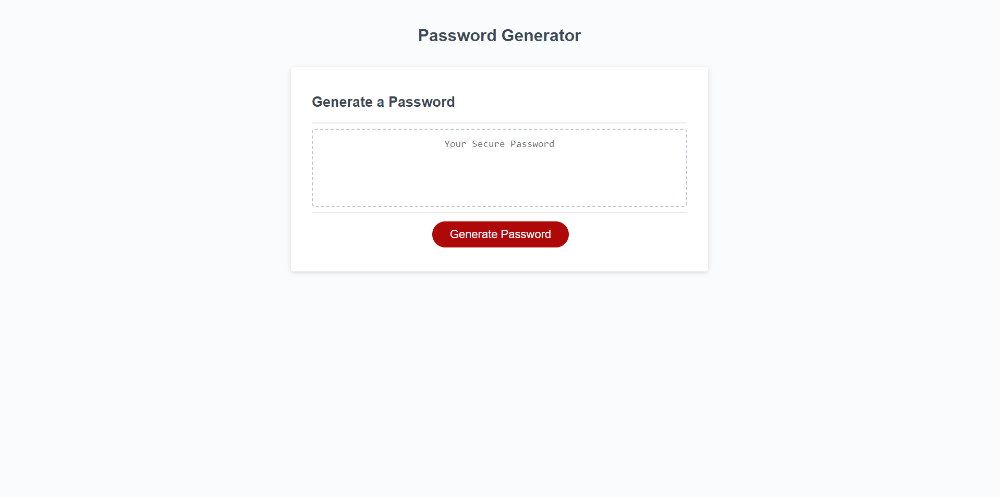

# Password Generator

## Description

The Password Generator application was designed to generate a random password given certain criteria by the user. 

## Installation

N/A

## Usage

Password Generator Link: https://itzelherndz.github.io/password-generator/

The user can use this webpage to generate a random password. Upon entering the webpage it will look like the following figure. 

The user can then begin the process of generating a password by clicking the "Generate Password" buton. Once clicked, the user will be prompted to enter a password length between 8 and 128 characters as demonstrated on the figure below. 

If the user enters a number less than 8 or greater than 128, then the application will alert the user that the entry is invalid and will be prompted to enter the password length again as shown in the figure below. 

After the user submits a valid user length, then the user will be alerted to make sure to pick at least one character type for the password like the figure below. 

Then the user will be prompted to confirm if they would like upper case characters, lower case characters, numbers, or special characters as demonstrated in the following figures. 

If the user does not select at least one character type for the password, then the user will be looped back to the character type alert message shown below and repeat the character confirm messages.

Once the user finishes completing the confirm messages with at least one character type being true, then the user will see a random password on the webpage where "Your Secure Passowrd" was once shown. The following figure demonstrates a random password generated with a passowrd length of 8 characters and all character types selected. 

## Credits

Rapstine, X (2020) Password Generator Starter Code [Source Code]. https://github.com/coding-boot-camp/friendly-parakeet.

“Generate A Random Letter From The Alphabet Using JavaScript,” www.coderrocketfuel.com. https://www.coderrocketfuel.com/article/generate-a-random-letter-from-the-alphabet-using-javascript (accessed Dec. 06, 2023).

K. J, “Shuffle characters of a string in JavaScript,” CodeSpeedy, Dec. 30, 2019. https://www.codespeedy.com/shuffle-characters-of-a-string-in-javascript/ (accessed Dec. 07, 2023).

## License

Please refer to the LICENSE file in the repository.
